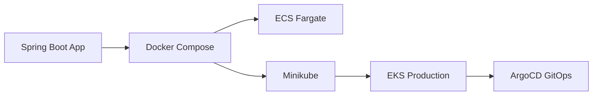

```markdown
# 🐳 container-deploy-lab

> From Dockerfile to EKS production — a complete container deployment journey.

[]()
[]()
[](LICENSE)

## 🎯 Vision

A Java Spring Boot application containerized and progressively deployed through
every container platform: Docker Compose → ECS Fargate → Minikube → EKS production.

Each deployment method is documented, automated, and reproducible.

## 🏗️ Deployment Journey



## 🛣️ Roadmap

- [ ] **W4** — Spring Boot app + Dockerfile (multi-stage, < 200 MB)
- [ ] **W4** — Docker Compose: app + PostgreSQL + Redis
- [ ] **W14** — Kubernetes manifests + Helm chart (Minikube)
- [ ] **W15** — GitOps with ArgoCD
- [ ] **W17** — ECS Fargate deployment via Terraform
- [ ] **W17** — EKS production deployment
- [ ] **W18** — Blue/Green (ECS) + Canary (K8s Argo Rollouts)

## 📂 Structure (planned)

```
container-deploy-lab/
├── app/                        # Spring Boot application
│   ├── src/
│   ├── Dockerfile
│   └── docker-compose.yml
├── terraform/
│   ├── ecs-fargate/
│   └── eks/
├── kubernetes/
│   ├── manifests/
│   │   ├── deployment.yaml
│   │   ├── service.yaml
│   │   ├── ingress.yaml
│   │   └── hpa.yaml
│   └── helm/
│       └── container-deploy/
│           ├── Chart.yaml
│           ├── values.yaml
│           ├── values-dev.yaml
│           └── values-prod.yaml
├── docs/
│   ├── docker-guide.md
│   ├── ecs-guide.md
│   └── eks-guide.md
└── .github/workflows/
```

## 🛠️ Tech Stack


## 📜 License
# devops-ai-tools
